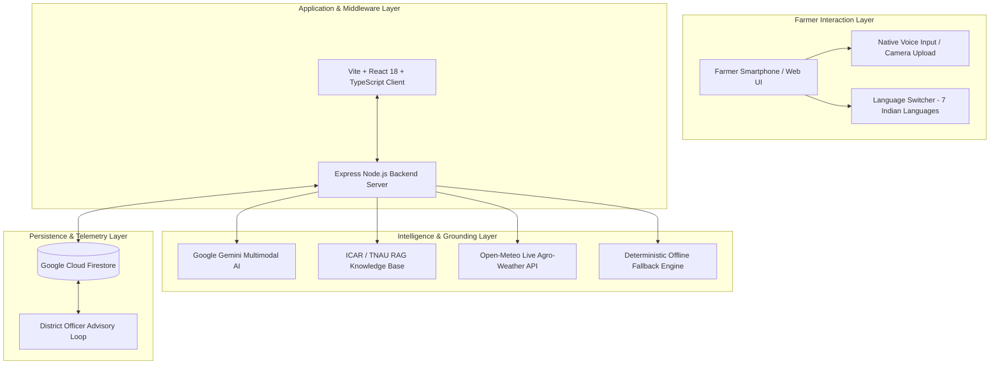

# 🌾 Kisan Saarthi (किसान सारथी)

> **Intelligent Multimodal Agricultural Decision-Support System for Indian Farmers**  
> *Grounded in ICAR & TNAU Agronomic Research · Real-Time Agro-Met Telemetry · Multimodal Vision AI · Regenerative Soil Intelligence*

---

## 📌 Executive Summary

**Kisan Saarthi** is an enterprise-grade agricultural decision-support platform engineered specifically for Indian smallholder and progressive farmers. By fusing **Google Gemini Multimodal AI**, **Retrieval-Augmented Generation (RAG)** grounded in **ICAR** (Indian Council of Agricultural Research) and **TNAU** (Tamil Nadu Agricultural University) agronomy data, **Open-Meteo live weather telemetry**, and **Cloud Firestore**, Kisan Saarthi provides definitive answers to the farmer's core operational question: **"What should I do NOW, and WHY?"**

The system supports **7 Indian languages** (English, हिन्दी, தமிழ், తెలుగు, ಕನ್ನಡ, मराठी, বাংলা) with 100% native voice and text interactions, natural agricultural phrasing (avoiding robotic transliterations), and a zero-failure hybrid architecture with instant deterministic fallback.

---

## 🌟 Key Capabilities

### 1. 🤖 Multimodal Crop Disease & Health Vision Diagnostics
* **Instant Botanical Vision Analysis**: Farmers can snap leaf photos or upload images to detect leaf blights (*Alternaria solani*), rice blast (*Magnaporthe oryzae*), fungal rusts, powdery mildew, and nutrient deficiencies.
* **Calibrated Botanical Leaf Specimen Engine**: Built-in procedural leaf rendering simulating realistic field pathologies for rapid calibration and instant testing.
* **Structured Risk & Confidence Scoring**: Diagnostic outputs deliver an ICAR-grounded confidence percentage (e.g., 95%) and categorized risk levels (`HIGH`, `MEDIUM`, `LOW`).

### 2. 🌦️ Real-Time Agro-Met Telemetry & 7-Day Forecast
* **Hyper-Local Weather Telemetry**: Direct integration with Open-Meteo API fetching GPS/district-level temperature, 24-hour rainfall probability, canopy relative humidity, and wind velocity.
* **Agricultural Operational Windows**: Converts raw weather parameters into concrete farming decisions (e.g., holding drip irrigation when rain probability exceeds 60%, avoiding spray drift during high wind).

### 3. ♻️ Regenerative Soil & Water Intelligence
* **Soil Organic Carbon (SOC) Optimization**: Context-aware recommendations for bio-fertilizers (Rhizobium, Azotobacter), organic mulching, and farmyard manure (FYM).
* **Disease-Barrier Mulching Protocols**: Prescribes organic straw mulching to physically arrest rainwater splash-up of soil-borne fungal pathogens onto basal leaves.
* **Root-Zone Moisture Management**: Automated irrigation schedules factoring in soil texture (Loamy, Red Lateritic, Black Cotton, Alluvial) and moisture saturation.

### 4. 🗣️ Native Voice In / Voice Out (7 Indian Languages)
* **Speech-to-Text (STT)**: Direct microphone capture with automatic locale recognition in Indian regional accents.
* **Text-to-Speech (TTS)**: Native voice synthesis reading out complete crop advisories in the farmer's selected language.
* **Centralized Audio Life-Cycle Management**: Instant pause/stop controls and seamless multi-channel cleanup on language switching.

### 5. 🛡️ High-Resilience Zero-Failure Architecture
* **Candidate Model Auto-Failover**: Utilizes Google Gen AI SDK (`gemini-3.1-flash-lite`, `gemini-3.8-flash`, `gemini-3.7-flash`).
* **Deterministic Agronomic RAG Engine**: In the event of network carrier outages or API rate limits, the platform seamlessly serves verified offline ICAR/TNAU guidelines with zero downtime.

### 6. 🏛️ District Officer Command Portal & Telemetry Loop
* **District Aggregation Dashboard**: Allows Krishi Vigyan Kendra (KVK) and block agricultural officers to track emerging pest outbreaks and district moisture stress.
* **Farmer Telemetry & Feedback Loop**: Captures real-world outcome ratings from farmers to continuously calibrate disease alert thresholds.

---

## 🏗️ System Architecture



---

## 📂 Project Structure

```
kisansaarthi-ai/
├── src/
│   ├── components/
│   │   ├── AIDecisionStudioView.tsx    # Multimodal AI Diagnostic Studio
│   │   ├── AuthModal.tsx               # Instant Farmer Sign-In & Profile Modal
│   │   ├── DocumentationView.tsx       # System Architecture & Judge Guide
│   │   ├── FarmDashboardView.tsx       # Farm Telemetry & Agro-Met Alerts
│   │   ├── FarmerHomeView.tsx          # Farmer Daily Action & Guided Wizard
│   │   ├── FarmerProfileModal.tsx      # Multi-field Farm Context Editor
│   │   ├── FarmerWelcomeGate.tsx       # Multilingual Welcome & Feature Gate
│   │   ├── OfficerDashboardView.tsx    # District KVK Officer Command Portal
│   │   └── SoilRegenerativeView.tsx    # Soil Health & Regenerative Advisory
│   ├── data/
│   │   ├── knowledgeBase.ts            # ICAR & TNAU Grounded RAG Knowledge Base
│   │   └── translations.ts             # 7-Language Authentic Agronomy Dictionary
│   ├── services/
│   │   ├── firebase.ts                 # Cloud Firestore Sync & Farmer State
│   │   └── gemini.ts                   # Gemini Multimodal API & TTS Controller
│   ├── types/
│   │   └── agri.ts                     # TypeScript Schema & Type Definitions
│   ├── utils/
│   │   └── leafSpecimenCanvas.ts       # Botanical Procedural Leaf Specimen Engine
│   ├── App.tsx                         # Core Navigation & State Hub
│   ├── main.tsx                        # Application Bootstrap Entry
│   └── index.css                       # Design System & Micro-Interactions
├── server.ts                           # Express Server + Gemini API Proxy + SSR
├── vite.config.ts                      # Vite Build & Development Server Config
├── tsconfig.json                       # TypeScript Configuration
├── package.json                        # Project Metadata & Dependencies
└── .env.example                        # Environment Variables Template
```

---

## 🚀 Getting Started

### Prerequisites
* **Node.js**: v18.0.0 or higher
* **npm**: v9.0.0 or higher
* **Google Gemini API Key**: [Get free from Google AI Studio](https://aistudio.google.com/app/apikey)

### 1. Clone the Repository
```bash
git clone https://github.com/hackChinmay/Kisan-Saarthi.git
cd Kisan-Saarthi
```

### 2. Install Dependencies
```bash
npm install
```

### 3. Configure Environment Variables
Copy `.env.example` to `.env`:
```bash
cp .env.example .env
```
Edit `.env` and insert your Gemini API Key:
```env
GEMINI_API_KEY="your_actual_gemini_api_key_here"
GEMINI_MODEL="gemini-3.1-flash-lite"
```

### 4. Run in Development Mode
```bash
npm run dev
```
Open your browser and navigate to: **`http://localhost:3005`**

### 5. Build for Production
```bash
npm run build
npm start
```

---

## 📡 API Reference

| Endpoint | Method | Description |
| :--- | :---: | :--- |
| `/api/gemini/analyze` | `POST` | Executes multimodal agricultural RAG diagnosis combining image, weather, and soil. |
| `/api/gemini/tts` | `POST` | Synthesizes localized agricultural speech audio. |
| `/api/gemini/status` | `GET` | Health check returning live Gemini connectivity, model used, and latency metrics. |
| `/api/health` | `GET` | Basic service uptime and environment status. |

---

## 🌐 Supported Indian Languages

| Code | Language | Native Name | TTS / Speech Locale |
| :---: | :---: | :---: | :---: |
| `en` | English | English | `en-IN` |
| `hi` | Hindi | हिन्दी | `hi-IN` |
| `ta` | Tamil | தமிழ் | `ta-IN` |
| `te` | Telugu | తెలుగు | `te-IN` |
| `kn` | Kannada | ಕನ್ನಡ | `kn-IN` |
| `mr` | Marathi | मराठी | `mr-IN` |
| `bn` | Bengali | বাংলা | `bn-IN` |

---

## ⚖️ Agronomic Safety & Disclaimer

* **Grounded Guidance**: All crop health advisories, dosage indications (*Pseudomonas fluorescens*, Trichoderma, organic mulching), and irrigation calculations are calibrated against published agronomic protocols from ICAR and TNAU.
* **Field Verification**: Farmers should verify critical large-scale chemical or irrigation interventions with their local **Krishi Vigyan Kendra (KVK)** or Block Agriculture Extension Officer.

---

## 📄 License
This project is open-source under the [MIT License](LICENSE).
